**ABSOLUTELY NO WARRANTY! USE AT YOUR OWN RISK!**

# Features of Halacs's firmware
* [x] Web user interface.
* [x] Wifi AP turns off after configuration.
* [x] NTP time synchronization. Server can be set via web UI.
* [x] Backup battery backed time source if NTP fails.
* [x] Optional blinking second LEDs.
* [x] Optional leading zeros.
* [x] Displaying numbers in a clever way.
* [x] Static brightness control.
* [x] Time zone management with automatic DST support.
* [x] OTA of Arduino IDE. Password is the same as the name of the AP.
* [ ] Drop down choice as time zone selector (instead of the current simple tex box)
* [ ] Find out why firmware update via the web UI doesn't work.
* [ ] Automatic brightness controll.
* [ ] Password protected web UI.
* [ ] MQTT client capabilities
* [ ] Syslog capabilities.

# The Device

## Hardware

The PCB is nice and clean, simple to program. Full schematic can be found [here](KiCad/schematic.pdf).

An ESP12-F microcontroller controls the display via a serial-to-paralel shift register array consists of four 74HC595D chip. Each segment made of 4 parallel LEDs. Second LEDs are also controlled from the array.

There is a DS3231SM Real Time Clock (RTC) chip managed via I2C. It has a temperature sensor with +/- 3 C precision. Original firmware offers displaing temperature but it never mentions the precision of the sensor which was originally designed to keep the clock precise within the RTC chip. No other temperature sensore on the PCB.

Display brightness can be set by PWM via the Output Enable (OE) pin of the shift registers. There is an environment light sensor too connected to the ADC pin of the ESP. It can help to set the right brightness if static one is not fit for your needs.

There is an unplaced connector with 6 pins for programming:

1. FLASH
2. RST
3. GND
4. RDX0
5. TXD0
6. +5V

Sixth pin is the closest one to the ESP12-f microcontroller.

After flashing your clock, at the first boot, wifi AP turns on under the name of *halclock....*  . SSID is fixed but the second part depends on the MAC address of the microcontroller. There has a hardcoded magic password: *password*. AP also turns on if WiFi client connection fails.

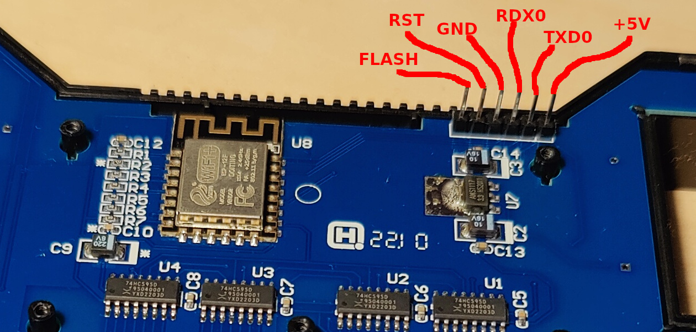

# Halacs's firmware

## My development environment
* Ubuntu 22.04.4 LTS (jammy)
* Arduino IDE 2.3.2
* Wemos D1 mini as development test board

## Landing page
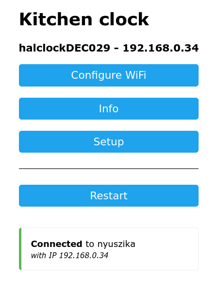

## Clock
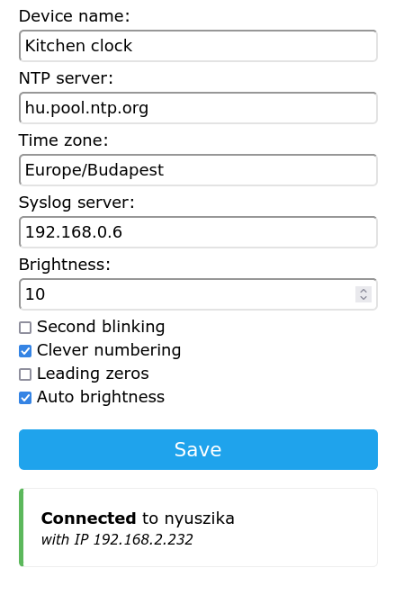

## Wifi
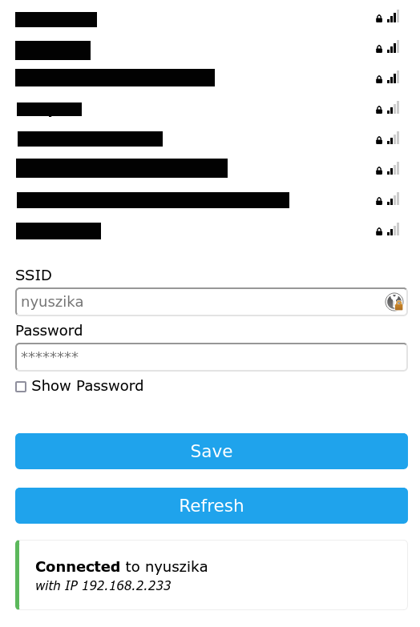

# Factory firmware

My factory firmware is available [here](factory_firmware/image4M.bin).

It was extracted the way as shown on the below screenshot.

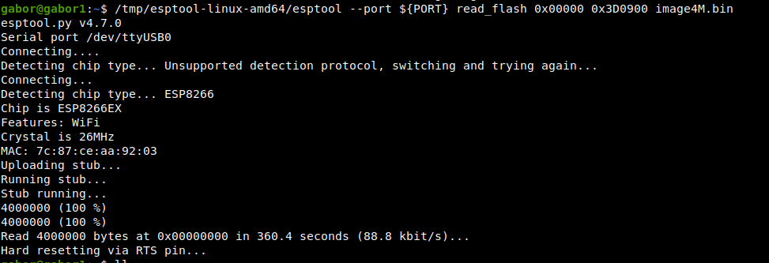

## Landing page
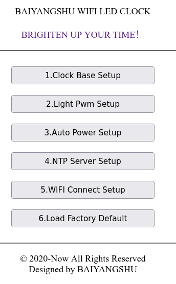

## Clock Base Setup
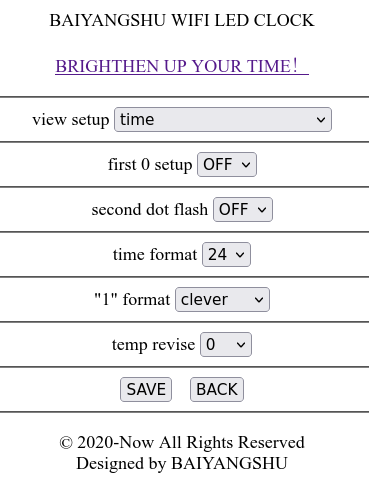

## Light Pwm Setup
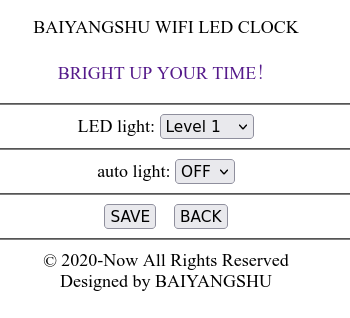

## Auto Power Setup
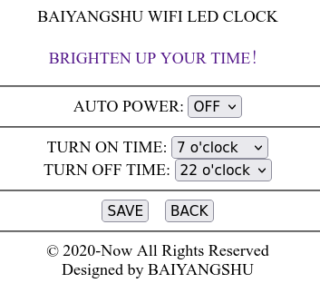

##  NTP Server Setup
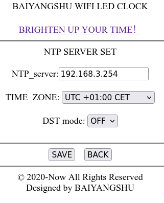

## WIFI Connect Setup
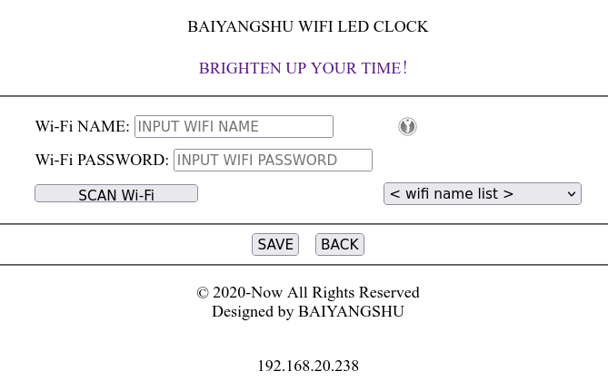

## Load Factory Default
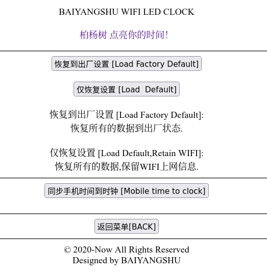

# Contribution

Feel free to open pull request against my repository.

When you do so please describe the change itself (e.g. feature you implemented) and the way how you have tested your changes.

Try to follow industry best practices :)
